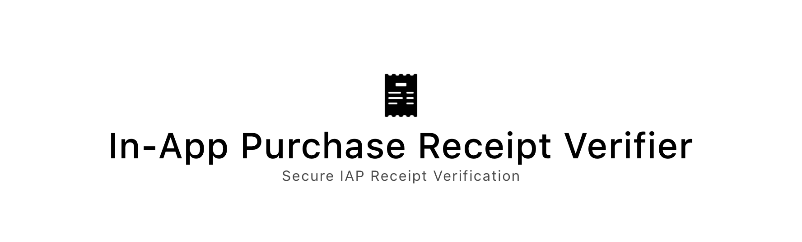
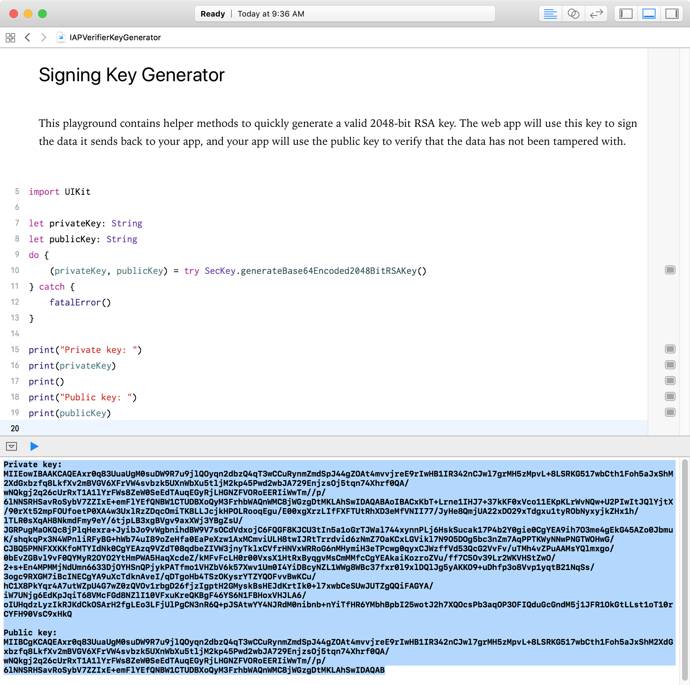

<!--
Copyright 2012-2018 Lionheart Software LLC

Licensed under the Apache License, Version 2.0 (the "License");
you may not use this file except in compliance with the License.
You may obtain a copy of the License at

   http://www.apache.org/licenses/LICENSE-2.0

Unless required by applicable law or agreed to in writing, software
distributed under the License is distributed on an "AS IS" BASIS,
WITHOUT WARRANTIES OR CONDITIONS OF ANY KIND, either express or implied.
See the License for the specific language governing permissions and
limitations under the License.
-->


[][lionheart-url]

[](https://heroku.com/deploy)

A simple, one-click deploy web app to simplify [the process of validating In-App Purchase receipts on the App Store](https://developer.apple.com/library/content/releasenotes/General/ValidateAppStoreReceipt/Chapters/ValidateRemotely.html#//apple_ref/doc/uid/TP40010573-CH104-SW1). Written using Django 1.11 and Python 3.6.2.

## Usage

### Deployment

1. (Optional, but highly recommended) Download [IAPVerifierKeyGenerator.playground](IAPVerifierKeyGenerator.playground) and run the playground. Copy the highlighted Base-64 encoded values below. Save these values for the next steps.

   

2. Create the project on [Heroku](https://heroku.com) using the Deploy Button above. Before you do, make sure that you've already obtained your app-specific shared secret for authentication from iTunes Connect. For the `BASE64_ENCODED_SIGNING_KEY` value, paste in the value for the private key from Step 1.

### In Your iOS App

1. Add `IAPReceiptVerifier` to your Podfile, then run `pod update`.

2. Use something like the following in your iOS app to validate your receipts.

    ```swift
    // Insert your Heroku app URL here.
    let url = URL(string: "https://your-app-name.herokuapp.com/verify")!

    // The Base 64 Encoded public key from Step 1.
    let publicKey = "..."

    // Create the receipt verifier from the above values.
    guard let verifier = IAPReceiptVerifier(url: url, base64EncodedPublicKey: publicKey) else {
        return
    }

    // Check the app store to see if there is a valid receipt.
    verifier.verify { receipt in
        guard let receipt = receipt else {
            // Someone tampered with the payload!
            return
        }

        // Your application logic here.
    }
    ```

## Local Testing

```
curl -X POST -T receipt https://your-app.herokuapp.com/verify
```

...where `receipt` is a file with base-64 encoded receipt data.

## License

In-App Purchase Receipt Verifier is available under the Apache 2.0 license. See the [LICENSE](LICENSE) file for more info.

[lionheart-url]: https://lionheartsw.com/

